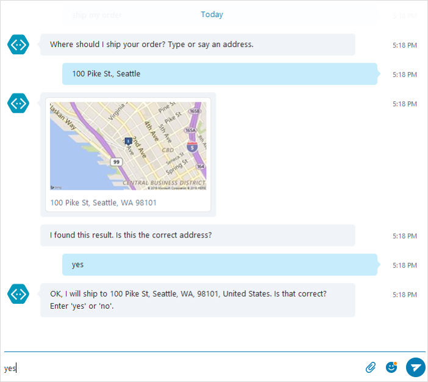

## Overview
The Bing location control for Microsoft Bot Framework makes the process of collecting and validating the user's desired location in a conversation easy and reliable. The control is available for C# and Node.js and works consistently across all channels supported by Bot Framework. 

## Why Use 
Bots often need the user's location to complete a task. For example, a Taxi bot requires the user's pickup location and destination before requesting a ride. Similarly, a Pizza bot must know the user's address to submit the order, and so on. Normally, bot developers need to use a combination of location or place APIs, and have their bots engage in a multi-turn dialog with users to get their desired location and subsequently validate it. The development steps are usually complicated and error-prone.  

The Bing location control makes this process easy by abstracting away the tedious coding steps to let the user pick a location and reliably validate it. The control offers the following capabilities: 

- Address look up and validation using Bing's Maps REST services. 
- Consistent conversational experience across all supported messaging channels.
- Address disambiguation when more than one address is found.
- Support for declaring required location fields.
- Support for Messenger's native location picker dialog.
- Open-source code (C# and Node.js) with customizable and localizable dialog strings. 

## Prerequisites
To start using the control, you need to obtain a Bing Maps API subscription key. You can sign up to get a free key with up to 10,000 transactions per month in [Azure Portal](https://azure.microsoft.com/en-us/marketplace/partners/bingmaps/mapapis/).

## Getting Started
Navigate to the [C#](https://github.com/Microsoft/BotBuilder-Location/tree/master/CSharp) or [Node.js](https://github.com/Microsoft/BotBuilder-Location/tree/master/Node) folder and follow the getting started guide to add the location control to your Bot Framework bot. 

## Examples
The examples demostrate different scenarios you can achieve using the Bing location control. 

**Address lookup with single result returned**

**Address lookup with multiple results returned**

**Address lookup with required fields filling**

**Address selection using FB Messenger's native location picker dialog**

### More Information
Read these resources to get started with Microsoft Bot Framework, the Bot Builder SDK and Bing Maps REST Services:

* [Microsoft Bot Framework Overview](https://docs.botframework.com/en-us/)
* [Microsoft Bot Framework Bot Builder SDK](https://github.com/Microsoft/BotBuilder)
* [Bing Maps REST Services Documentation](https://msdn.microsoft.com/en-us/library/ff701713.aspx)
